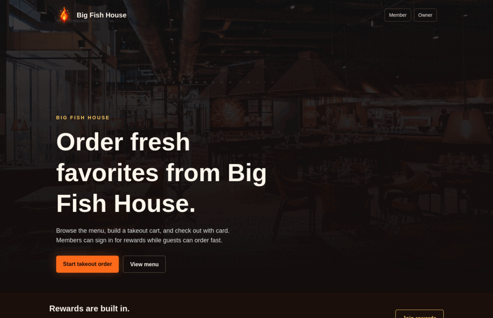

# SparkServe

SparkServe is a self-hostable restaurant ordering and POS platform for small restaurants that want QR table ordering, takeout checkout, kitchen operations, owner menu management, and payment routing without starting with a large vendor stack.

<p align="center">
  
</p>

<p align="center">
  <strong>Restaurant storefront · QR table sessions · shared carts · kitchen queue · Stripe checkout · owner tools</strong>
</p>

## Current Highlights

### Working Today

- **Restaurant storefront**: homepage, menu preview, PDF menu view, takeout entry, rewards/account entry points.
- **QR table sessions**: each table opens a tokenized ordering session with a shared live cart.
- **Realtime ordering**: Socket.IO table rooms broadcast cart updates, participants, owner verification events, and kitchen queue refreshes.
- **Table owner flow**: first guest can become table owner, verify phone with a dev 6-digit code, and control per-order kitchen approval.
- **Customer item modals**: customers can inspect ingredients, allergen warnings, spice levels, quantity, and allowed removals before adding.
- **Kitchen queue**: submitted dine-in and takeout orders show kitchen-facing item lines and modifications.
- **Takeout checkout**: customers can build a takeout cart and start Stripe Checkout.
- **Dine-in checkout**: unpaid kitchen orders for a table can be combined into one Stripe Checkout.
- **Owner menu management**: owners can create menu items, attach reusable ingredients, mark allergens, upload photos through Cloudflare R2, and audit meaningful menu changes.
- **Employee/customer auth split**: employee owner/staff flows are separate from optional customer membership/rewards accounts.
- **Terraform deployment shape**: per-restaurant env files, Docker Compose, NGINX, Prometheus/Grafana, and host push automation live under `infra/terraform`.

### In Progress

- Owner-configurable serving scales: small/medium/large, half/whole, half-and-half, double portions, weight-based pricing.
- Manager code approval for sensitive floor actions such as canceling table sessions, voids, and refunds.
- Customer order history, reorder buttons, and favorite dish counts.
- Menu inventory ingredients, item popularity reports, and CSV exports.
- Production SMS provider for owner/kitchen verification codes.

The full build plan lives in [POS_PLATFORM_PLAN.md](POS_PLATFORM_PLAN.md).

## App Preview Assets

Current repo preview media:

<p align="center">
  
</p>

```md

```

Source brand images are committed under:

```text
pos-app/public/brand/
pos-app/public/menu/
```

Use these paths when you need the original brand assets:

```md


```

Recommended GIFs to capture next:

- `table-ordering-flow.gif`
- `kitchen-queue-live-update.gif`
- `owner-menu-upload.gif`
- `takeout-checkout.gif`

## Architecture

```text
Customer phone / staff tablet
  |
  v
NGINX reverse proxy
  |
  v
Next.js App Router
  |
  +--> PostgreSQL via Prisma
  +--> Socket.IO realtime server
  +--> Stripe Checkout
  +--> Cloudflare R2 menu images
```

Repository layout:

```text
pos-app/          Next.js application, Prisma schema, realtime server
infra/terraform/ Per-restaurant generated envs, Docker Compose, hosts, monitoring
monitoring/      Prometheus config for local platform monitoring
nginx/           Reverse proxy config
```

## Core Platform Mechanics

These snippets highlight the parts that make SparkServe more than a menu page: durable table identity, owner-controlled order security, realtime invalidation, multi-order checkout, and per-restaurant infrastructure generation.

### Device Identity Is Separate From Account Identity

Table ownership is tied to a browser/device `participantPublicId`, while loyalty login is tied to a Better Auth user. That separation lets a guest scan a QR code, become the session owner, log in for rewards, log out later, and still return to the same table participant.

```ts
if (signedInUserId && existingDeviceParticipant?.userId === null) {
  return {
    action: "attach-account-to-device",
    participant: existingDeviceParticipant,
    userId: signedInUserId,
    displayName: accountDisplayName ?? existingDeviceParticipant.displayName,
  };
}

if (!signedInUserId && existingDeviceParticipant?.userId) {
  return {
    action: "detach-account-from-device",
    participant: existingDeviceParticipant,
    displayName: existingDeviceGuestName ?? `${tableLabel} Guest 1`,
  };
}
```

Source: `pos-app/lib/table-participant-identity.ts`

### First Guest Becomes Owner, But Orders Stay Gated

The first participant in a table session becomes `OWNER`; later devices are guests. Ordering stays locked until the owner verifies the table phone. This protects against someone nearby scanning a QR code and adding food unnoticed.

```ts
const role =
  existingParticipantCount === 0
    ? TableSessionParticipantRole.OWNER
    : TableSessionParticipantRole.GUEST;

return prisma.tableSessionParticipant.create({
  data: {
    tableSessionId,
    userId,
    publicId: await createUniqueParticipantPublicId(),
    displayName,
    role,
  },
});
```

Source: `pos-app/server/table-sessions-server.ts`

### Per-Order Verification Is Optional Per Table

After the owner verifies their phone, they can choose faster ordering or require a fresh 6-digit approval code for each cart sent to the kitchen. The gate is pure enough to test independently.

```ts
export function canSubmitKitchenOrder({
  sessionStatus,
  ownerPhoneVerifiedAt,
  orderVerificationRequired,
  hasPendingVerificationCode,
}: {
  sessionStatus: TableSessionStatusLike;
  ownerPhoneVerifiedAt?: Date | string | null;
  orderVerificationRequired: boolean;
  hasPendingVerificationCode: boolean;
}) {
  if (!canTableAcceptOrders({ sessionStatus, ownerPhoneVerifiedAt })) {
    return false;
  }

  return !orderVerificationRequired || hasPendingVerificationCode;
}
```

Source: `pos-app/lib/table-owner-verification.ts`

### Sending To Kitchen Freezes The Shared Cart

The table cart is mutable while guests are deciding. Once submitted, the app calculates totals from server-side menu prices, creates immutable `OrderItem` snapshots, carries allergen removals into the kitchen ticket, clears the cart, and notifies the kitchen queue.

```ts
const order = await prisma.$transaction(async (tx) => {
  const createdOrder = await tx.order.create({
    data: {
      tableSessionId: session.id,
      status: OrderStatus.SENT_TO_KITCHEN,
      subtotalCents: totals.subtotalCents,
      taxCents: totals.taxCents,
      totalCents: totals.totalCents,
      requestedByParticipantId: participant.id,
      submittedAt: new Date(),
      items: {
        create: cartItems.map((item) => ({
          menuItemId: item.menuItemId,
          name: item.menuItem.translations[0]?.name ?? `Menu item #${item.menuItemId}`,
          quantity: item.quantity,
          unitPriceCents: item.menuItem.priceCents,
          lineTotalCents: item.quantity * item.menuItem.priceCents,
          note: item.note,
          removedIngredientIds: item.removedIngredientIds,
        })),
      },
    },
  });

  await tx.tableSessionItem.deleteMany({ where: { tableSessionId: session.id } });
  return createdOrder;
});

await notifyKitchenQueueChanged("dine-in-submitted");
```

Source: `pos-app/app/table/[token]/actions.ts`

### Realtime Uses Invalidation, Not Blind Trust

Socket.IO broadcasts lightweight events such as `kitchen:refresh`. Browsers then re-read the authoritative state from Postgres. This keeps realtime UX without treating socket payloads as trusted order data.

```ts
export async function notifyKitchenQueueChanged(reason: KitchenRefreshReason) {
  await new Promise<void>((resolve) => {
    const socket = io(realtimeUrl, {
      autoConnect: false,
      reconnection: false,
      timeout: 1000,
      transports: ["websocket"],
    });

    socket.on("connect", () => {
      socket.emit("kitchen:notify", { reason });
      socket.disconnect();
      resolve();
    });

    socket.on("connect_error", resolve);
    socket.connect();
  });
}
```

Source: `pos-app/lib/kitchen-realtime.ts`

### Checkout Combines Multiple Kitchen Orders

A table may order several rounds before paying. Checkout rolls every unpaid kitchen order into one receipt, calculates platform fees in basis points, and routes payment to a connected Stripe account with an application fee.

```ts
const totals = calculateCheckoutTotals({
  orders: orders.map((order) => ({
    subtotalCents: order.subtotalCents,
    taxCents: order.taxCents,
    tipCents: order.tipCents,
    totalCents: order.totalCents,
  })),
  platformFeeBasisPoints,
});

if (connectedAccountId) {
  paymentIntentData.transfer_data = { destination: connectedAccountId };

  if (totals.platformFeeCents > 0) {
    paymentIntentData.application_fee_amount = totals.platformFeeCents;
  }
}
```

Sources: `pos-app/lib/checkout.ts`, `pos-app/app/api/table/[token]/checkout/stripe-session/route.ts`

### R2 Uploads Use Explicit Request Signing

Owner menu photos are validated before upload, stored in Cloudflare R2 through the S3-compatible API, and saved as public asset URLs. The app stores object URLs/keys rather than database blobs.

```ts
const canonicalRequest = [
  "PUT",
  canonicalUri,
  "",
  `${canonicalHeaders}\n`,
  signedHeaders,
  bodyHash,
].join("\n");

const signature = createHmac(
  "sha256",
  getSigningKey(config.secretAccessKey, dateStamp),
)
  .update(stringToSign)
  .digest("hex");
```

Source: `pos-app/lib/menu-image-storage.ts`

### Terraform Generates One Deployment Bundle Per Restaurant

Restaurant hosts are data-driven. Adding a restaurant to `terraform.tfvars` produces that host's Compose file, `.env.production`, NGINX config, and Prometheus agent config from templates.

```hcl
resource "local_sensitive_file" "restaurant_env" {
  for_each = var.restaurants

  filename = "${path.module}/generated/restaurants/${each.key}/pos-app.env"

  content = templatefile("${path.module}/templates/restaurant-env.tftpl", {
    restaurant = each.value
    google = lookup(var.restaurant_google_oauth, each.key, {
      enabled       = false
      client_id     = ""
      client_secret = ""
    })
    stripe = lookup(var.restaurant_stripe, each.key, {
      secret_key           = ""
      publishable_key      = ""
      connected_account_id = ""
      webhook_secret       = ""
    })
    r2 = lookup(var.restaurant_r2_storage, each.key, {
      account_id        = ""
      access_key_id     = ""
      secret_access_key = ""
      bucket            = ""
      public_base_url   = ""
    })
  })
}
```

Source: `infra/terraform/restaurants.tf`

### Terraform Pushes And Validates Restaurant Hosts

The generated bundle is pushed over SSH to each restaurant host. Terraform tracks content hashes in state so a changed env, Compose file, NGINX config, or Prometheus config triggers the push again.

```hcl
resource "null_resource" "push_restaurant_compose" {
  for_each = var.restaurants

  triggers = {
    compose_sha = local_file.restaurant_compose[each.key].content_sha256
    env_sha     = local_sensitive_file.restaurant_env[each.key].content_sha256
    nginx_sha   = local_file.restaurant_nginx[each.key].content_sha256
    agent_sha   = local_file.restaurant_prometheus_agent[each.key].content_sha256
  }

  provisioner "file" {
    source      = local_sensitive_file.restaurant_env[each.key].filename
    destination = "${each.value.deploy_base_path}/${each.key}/pos-app/.env.production"
  }

  provisioner "remote-exec" {
    inline = ["cd ${each.value.deploy_base_path}/${each.key}", "docker compose config"]
  }
}
```

Source: `infra/terraform/restaurants.tf`

### Monitoring Hosts Are Managed The Same Way

Monitor hosts are also map-driven, so a primary or backup monitor can be added without changing the Terraform structure. Each monitor gets generated Prometheus, Grafana, and Blackbox Exporter Compose assets.

```hcl
resource "local_file" "monitor_prometheus" {
  for_each = var.monitors

  filename = "${path.module}/generated/monitors/${each.key}/prometheus/prometheus.yml"

  content = templatefile("${path.module}/templates/monitor-prometheus.yml.tftpl", {
    monitor     = each.value
    restaurants = var.restaurants
  })
}
```

Source: `infra/terraform/monitors.tf`

## Local Development

From the app directory:

```bash
cd pos-app
yarn install
npx prisma generate
yarn dev
```

Run the Socket.IO server in another terminal:

```bash
cd pos-app
yarn dev:socket
```

Run tests:

```bash
cd pos-app
yarn test
```

Seed demo data:

```bash
cd pos-app
yarn db:seed
```

## Required Local Environment

Local secrets live in ignored files:

```text
pos-app/.env
pos-app/.env.production
infra/terraform/terraform.tfvars
```

Important app values:

```env
DATABASE_URL=
BETTER_AUTH_URL=
BETTER_AUTH_SECRET=
GOOGLE_CLIENT_ID=
GOOGLE_CLIENT_SECRET=
STRIPE_SECRET_KEY=
NEXT_PUBLIC_STRIPE_PUBLISHABLE_KEY=
STRIPE_CONNECTED_ACCOUNT_ID=
STRIPE_WEBHOOK_SECRET=
R2_ACCOUNT_ID=
R2_ACCESS_KEY_ID=
R2_SECRET_ACCESS_KEY=
R2_BUCKET=
R2_PUBLIC_BASE_URL=
NEXT_PUBLIC_REALTIME_URL=
```

## Deployment Notes

The Terraform deployment layer is in:

```text
infra/terraform
```

SparkServe is designed as a small self-hosted platform:

- **Restaurant hosts** run the actual ordering stack for one restaurant: Next.js, Postgres, NGINX, and Prometheus Agent.
- **Monitor hosts** run shared observability: Prometheus, Grafana, and Blackbox Exporter.
- **Terraform state** tracks generated host artifacts and content hashes so host bundles can be regenerated, pushed, and validated repeatedly.
- **Per-restaurant secrets** are injected from ignored `terraform.tfvars` maps into generated `.env.production` files.
- **Generated files** live under `infra/terraform/generated/` so you can inspect what Terraform will push before applying it.

Restaurant bundles include:

```text
generated/restaurants/<restaurant>/
  docker-compose.yml
  pos-app.env
  nginx/default.conf
  prometheus/prometheus.yml
```

Monitor bundles include:

```text
generated/monitors/<monitor>/
  docker-compose.yml
  grafana.env
  prometheus/prometheus.yml
```

Real production values should be placed in ignored `terraform.tfvars`, not in templates.

Typical flow:

```bash
cd infra/terraform
terraform plan
terraform apply
```

Terraform then uses SSH/file provisioners to place generated configs on the target host and runs `docker compose config` remotely as a validation step.

## Commit Style

The project currently uses scoped commit prefixes such as:

```text
(branding) Rename Ablaze to SparkServe
(table_orders) Display removed ingredients to table session
(terraform) Connect cloudflare env to restaurants for menu images cloud storage
(repo) Extract SparkServe platform layout
```

Keep commits small and product-area specific when possible.
